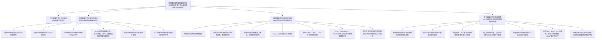

```mermaid
graph TD;
    A[针刺靶向星形胶质细胞-神经元线粒体转移干预心脏骤停后脑损伤的研究] --> B1[评价醒脑开窍针刺法提高CPR脑复苏的效应];
    A --> B2[探究醒脑开窍针刺法改善线粒体功能障碍的脑保护效应];
    A --> B3[探究醒脑开窍针刺法发挥脑保护效应的线粒体转移机制];
    A --> B4[探寻醒脑开窍针刺法调控TNT途径促进线粒体跨细胞转移的机制];
    B2 --> D1[透射电镜观察神经元线粒体形态结构];
    B2 --> D2[荧光显微镜观察线粒体形态及分布];
    B2 --> D3[流式细胞术检测神经元细胞内ROS水平];
    B2 --> D4[ELISA检测谷氨酸水平、Ca2+浓度、ATP合成酶及超氧化物歧化酶活性];
    B2 --> D5[荧光显微镜检测线粒体膜电位变化];
    B2 --> D6[探讨针刺法对线粒体功能障碍的调节作用];
    B3 --> E1[构建脑缺血再灌注细胞模型];
    B3 --> E2[荧光标记技术观察线粒体转移速率、数量及分布];
    B3 --> E3[电镜分析线粒体长度、体积、球度及空间分布];
    B3 --> E4[Seahorse分析线粒体呼吸率];
    B3 --> E5[检测mtDNA、JC-1、MMP评估线粒体活性];
    B3 --> E6[PCR、AnnexinV/PI、TUNEL分析mtDNA修复及神经细胞存活];
    B3 --> E7[探讨针刺法促进星形胶质细胞向神经元转移线粒体的机制];
    B4 --> F1[基因编辑调控TNTs形成及线粒体转移相关基因];
    B4 --> F2[微分干涉显微镜分析TNT数量及结构变化];
    B4 --> F3[免疫荧光、流式细胞术观察线粒体转移及TNT连接];
    B4 --> F4[蛋白质免疫印迹、qPCR检测TNT生成关键分子表达];
    B4 --> F5[免疫荧光染色观察关键分子定位及分布变化];
    B4 --> F6[检测Ca2+、ROS、ATP合成酶、超氧化物歧化酶、BDNF等分子水平];
    B4 --> F7[明确针刺法通过TNT途径促进线粒体跨细胞转移的机制];
```
